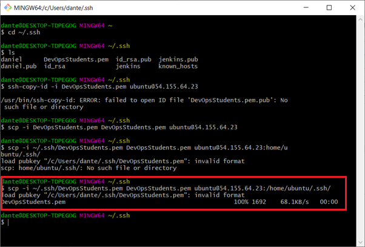

# Bastion server

A bastion is a special purpose server instance that is designed to be the primary access point from the Internet and acts as a proxy to your other EC2 instances

## Troubleshooting tips
- Check security groups
- Checkbound Inbound and Outbound rules
- Check file permissions (Does it need executable rights?)
- Are you using the right IP address? Some will be public IP some Private

## Creating a Bastion Instance 
##### 1) First I Created a new DB instance. Network being the VPC, subnet the private subnet and public IP enable.


##### 2) I created a new SG and added the following inbound rules. These could change however.


##### 3) I then created a new EC2 instance titled bastion. Remember to use correct naming conventions. Network the VPC I created, Subnet the public subnet and enable public IP. Carry on with the conf until the instance has been created.


##### 4) Once the Instance is created I obtained the Public IP from the Bastion instance. Seen below.


##### 5) Using the Public IP from the Bastion instance I then SSHED into the VM using the code

```python
ssh -i ~/.ssh/DevOpsStudents.pem ubuntu@VM_IP_ADRESS
```


##### 6) Now I clicked on the DB instance and used the private IP to ssh in. Private IP is located in red.


##### 7) Using the private IP from the DB instance I then SSHed into the bastion. If any errors occur It could be down to the inbound rules or the security group. I got an error when entering the VM as seen below


##### 8) The reason I got permission denied is because the VM does not have the key yet so we must send the key to the VM. To transfer the key I went into the ssh directory and used :

```python
scp -i ~/.ssh/DevOpsStudents.pem DevOpsStudents.pem ubuntu@54.155.64.23:/home/ubuntu/.ssh/
```
##### Make sure to use the command in your OS



##### 9) Now I ssh into the bastion instance. If you enter use ls-a you can view the .ssh folder and cd inside. As You can see the key is now available in the .ssh directory on the Bastion VM.


##### 10) I tried to enter the db VM but got a bad permissions, permission denied error. To overcome this, I used chmod 600 on the key and then sshed inside the DB instance using the private IP.

```python
chmod 600 FILENAME
```


##### 11) I have now entered the DB instance via the bastion instance

