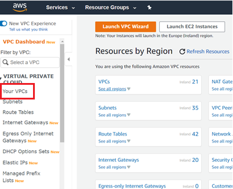
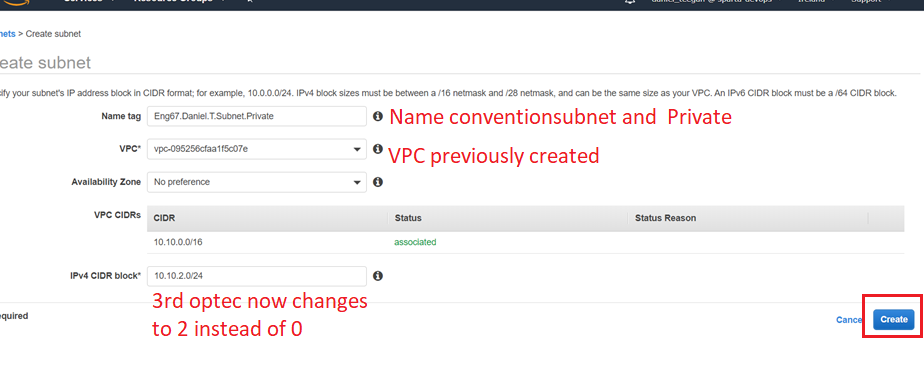

# Networking

## Region & Availability zones

- Region is a close cluster of data centres.
- Within the region we have availability zone, which are logically connected but physically segregated data centres inside a region.

## Creating the VPC
#### 1) Search for VPC in the AWS dashboard and click VPC

##### 2) Click on “Your VPC” on the left and then “Create VPC”

##### 3) Give the VPC a name tag and IPv4 CIDR block and click create

## Creating the Internet Gateway IG

##### 1) Click on Internet gateways on the left hand side

##### 2) Add a name tag remember to use correct naming conventions. In the tag options add a new tag with a key of name and value of the nametag. I have added IGW in the name. Then click on create internet gateway

##### 3) Next click on actions in the top right and then attach to VPC

##### 4) Then attach the VPC that you created previously. And click on attach internet gateway. This will succesfully create the internet gateway

## Creating a Subnet

##### 1) Click on Subnets located in the left hand side toolbar

##### 2) Then click on create subnet

##### 3) Creating public subnet! Fill in the information for the subnet. Remember correct naming conventions. I selected the VPC I recently created and used the same CIDR block IP. Once added click on create

##### 4) Click create subnet to be taken back to this page. Creating private subnet! Add the same information for the public subnet however the CIDR block IP changes slightly as seen below

## Creating a Route Table

##### 1) On the left hand toolbar click on route table

##### 2) Have the public route selected and click actions and edit routes

##### 3) Then add a destination and target. The target I used was the internet gateway created earlier. Then click save routes

##### 4) One the public route click on subnet associations and then edit subnet associations  

##### 5) Select the public subnet and click on save

## Creating a Network ACL

##### 1) On the left hand side toolbar under security click on Network ACLs and then click create network ACL

##### 1)