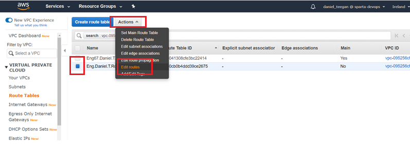

# Networking

## Region & Availability zones

- Region is a close cluster of data centres.
- Within the region we have availability zone, which are logically connected but physically segregated data centres inside a region.

### INGRESS – Inbound
- SSH for us and automation servers
- Dev ports for us
- Internet ports for the world

### EGRESS – Outbound 
- default (0.0.0.0)


### N-Tier Architecture

n = any number
division of system into logical tiers
usually done with networking, and increase robustness and flexibility
app tier, db tier. Flexibility created due to
app tier contains JS server
db tier containts mongo db

#### mutable vs immutable

instagram app is immutable as layout is always same.
so can create multiple app machines if one goes down, easy to replicate/scale up and down
database is mutable, may go down and lose some data
one is main database, others take other is needed
more servers to ensure less down time

#### monolith archiecture

single "block" network
eg. on server running BD + logic + presentation etc.
mainframe = JS server running everything
server and website on same mainframe meanes if any of the components fail then website goes down
associated costs with that
no flexibility or robustness, high costs, low ease of use

#### micro services business example

tesco contracted us to handle all cheese sales
API tier accessed to and from tesco
This then interacts with db tier
app tier interacts with db tier alongside CRUD guidelines
create, record, update delete
micros services would be to break down websites functions into differnt servers
e.g internally adding more cheese and externally buying more cheese

### Important Terninology
- VPC - Virtual Private Cloud in AWS to launch computing resources.
- IGW - Internet gateway, attached to the VPC and allows internet into the VPC via route table.
- Subnet - Internal networking
- NACLs - Network Access Control list, this is an optional layer of security for your machine. (A firewall at the level of a subnet)
- Route Tables - Contains a set of rules, called routes that determine where network traffic from a subnet or gateway is directed.
- SG - Security Group / Firewall
- EC2 - Amazon Elastic Compute Cloud

### What is a VPC?

- a vpc is a virtual private cloud, where can define a virtual network to launch aws resoucres in
- tier 2 means seperating servers into app and db for example
- this creates a multi tier architecture and is therefore more robust

### What is a internet gateway? IGW

An internet gateway serves two purposes: to provide a target in your VPC route tables for internet-routable traffic, and to perform network address translation (NAT) for instances that have been assigned public IPv4 addresses. An internet gateway supports IPv4 and IPv6 traffic.

### What is a Subnet?

- a segment of a VPC’s IP address range where you can place groups of isolated resources
- can be used to limit ips used

### What is a route table?

A route table contains a set of rules, called routes, that are used to determine where network traffic from your subnet or gateway is directed.

### What is Network ACL?

- in NACL you Need to set outbound rules. By default, outbound traffic is denied

- Rules number matter, and you can deny IP as well as allow


## Creating the VPC
#### 1) Search for VPC in the AWS dashboard and click VPC


##### 2) Click on “Your VPC” on the left and then “Create VPC”


##### 3) Give the VPC a name tag and IPv4 CIDR block and click create


## Creating the Internet Gateway IG

##### 1) Click on Internet gateways on the left hand side


##### 2) Add a name tag remember to use correct naming conventions. In the tag options add a new tag with a key of name and value of the nametag. I have added IGW in the name. Then click on create internet gateway


##### 3) Next click on actions in the top right and then attach to VPC


##### 4) Then attach the VPC that you created previously. And click on attach internet gateway. This will succesfully create the internet gateway


## Creating a Subnet

##### 1) Click on Subnets located in the left hand side toolbar


##### 2) Then click on create subnet


##### 3) Creating public subnet! Fill in the information for the subnet. Remember correct naming conventions. I selected the VPC I recently created and used the same CIDR block IP. Once added click on create


##### 4) Click create subnet to be taken back to this page. Creating private subnet! Add the same information for the public subnet however the CIDR block IP changes slightly as seen below


## Creating a Route Table

##### 1) On the left hand toolbar click on route table


##### 2) Have the public route selected and click actions and edit routes



##### 3) Then add a destination and target. The target I used was the internet gateway created earlier. Then click save routes.


##### 4) One the public route click on subnet associations and then edit subnet associations.


##### 5) Select the public subnet and click on save.


## Creating a Network ACL

##### 1) On the left hand side toolbar under security click on Network ACLs and then click create network ACL.


##### 2) Enter a name tag. Remember naming conventions I added NACL into this nametag. I selected the VPC created previously and clicked on create.


##### 3) I then clicked edit inbound rules of the NACL just created and added the following:


##### 4) I then clicked on edit outbound rules and added the following. I allowed all traffic out. I then clicked save.


##### 5) Then click on subnet associations and edit subnet associations.


##### 6) In the subnet associations select the public subnet created earlier and select edit 


## Creating a new EC2 Instance to check the VPC is working

##### 1) I created a new EC2 Instance and went through the configuration. One the page below remember to add the VPC and subnet previously created.


##### 2) Once the EC2 instance has been created I then SSH into the VM using the VM IP address
```python
ssh -i ~/.ssh/DevOpsStudents.pem ubuntu@VM_IP_ADRESS
```


##### 3) I went into root using ```sudo su``` and then installed Nginx on the VM using ``` apt-get install nginx```


##### 4) Using the EC2 instances IP address we can see Nginx has installed succesfully. This means our VM has access to the internet


